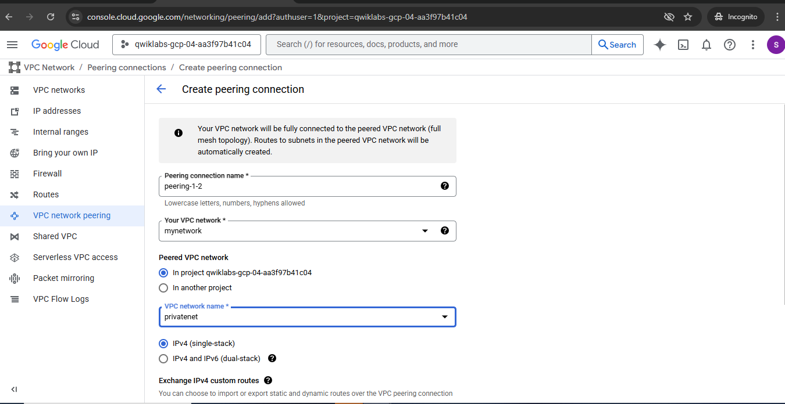

# Custom-VPC-Networking-and-Compute-Engine-Setup-in-Google-Cloud
This project focuses on creating custom VPC networks with firewall rules, setting up VM instances in Google Cloud using Compute Engine, and exploring network connectivity between instances across different VPC

## Objective
To securely connect two VPC networks within the same Google Cloud project using VPC Network Peering.

## Steps
1. Created two VPC networks: `mynetwork` and `privatenet`.
2. Created peering connections `peering-1-2` and `peering-2-1`.
3. Verified active peering status.
4. Confirmed private IP communication enabled between both networks.

## Screenshots
- 
- )
