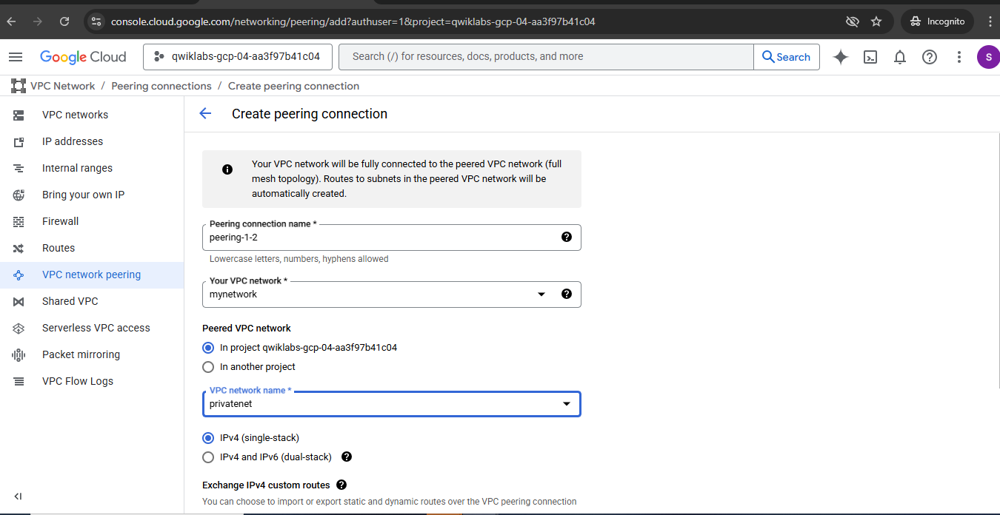
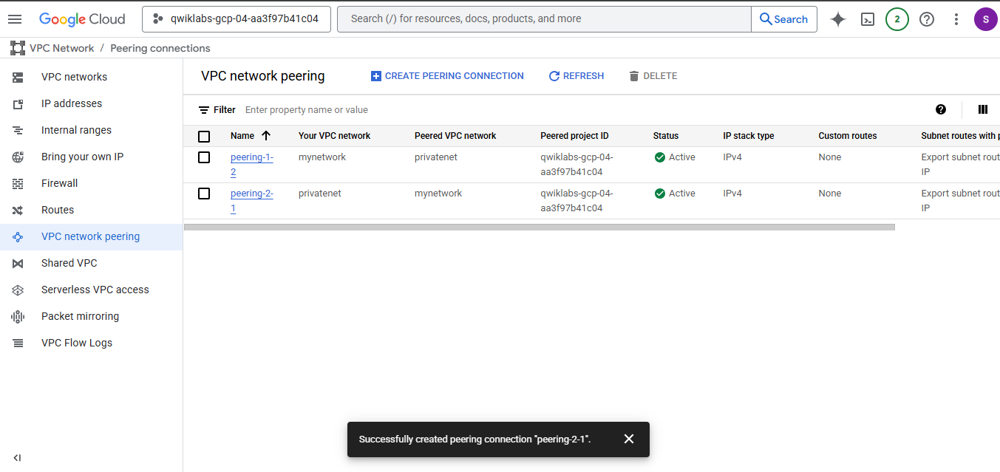

# Custom-VPC-Networking-and-Compute-Engine-Setup-in-Google-Cloud
This project demonstrates how to set up custom Virtual Private Cloud (VPC) networks and establish VPC Network Peering in Google Cloud Platform (GCP). It covers network creation, peering configuration, and verification of private communication across networks.

## Objective
To securely connect two VPC networks within the same Google Cloud project using VPC Network Peering.

## Steps
1. Created two VPC networks: `mynetwork` and `privatenet`.
2. Created peering connections `peering-1-2` and `peering-2-1`.
3. Verified active peering status.
4. Confirmed private IP communication enabled between both networks.

## Screenshots

